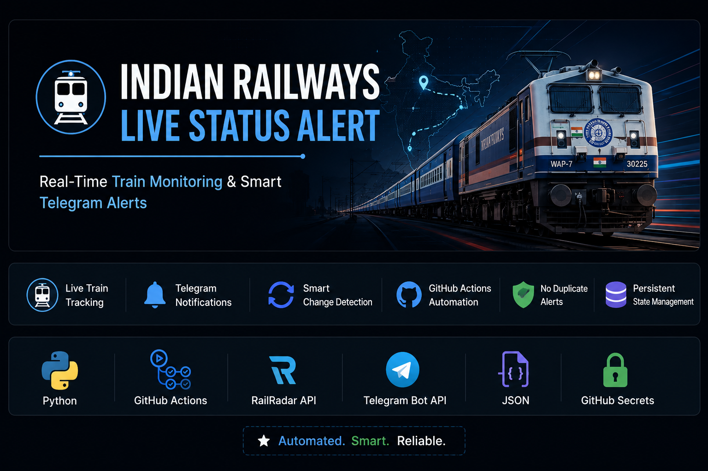

<p align="center">
  
</p>


# 🚆 Indian Railways Live Status Alert

An automated train monitoring system built with **Python**, **GitHub Actions**, **RailRadar API**, and **Telegram Bot API** that continuously tracks live train status and sends notifications only when meaningful changes occur.

---

## ✨ Features

- 🚆 Live Train Status Tracking
- 🤖 Automatic Telegram Notifications
- 🔄 Smart Change Detection
- ⏰ Scheduled Monitoring using GitHub Actions
- 💾 Persistent State Management
- 🚫 Prevents Duplicate Alerts
- 🔐 Secure API Keys using GitHub Secrets

---

## 🛠 Tech Stack

| Technology | Purpose |
|------------|---------|
| Python | Core Application |
| GitHub Actions | Automation & Scheduling |
| RailRadar API | Live Train Status |
| Telegram Bot API | Notifications |
| JSON | Previous Status Storage |
| GitHub Secrets | Secure API Keys |

---

## 📂 Project Structure

```text
Indian-Railways-Live-Status-Alert
│
├── .github/
│   └── workflows/
│       └── train.yml
│
├── train.py
├── previous_status.json
├── requirements.txt
├── README.md
└── LICENSE
```

---

## ⚙️ How It Works

```text
                RailRadar API
                      │
                      ▼
              GitHub Actions
          (Runs Every 30 Minutes)
                      │
                      ▼
                Python Script
                      │
                      ▼
         Compare Previous Status
                      │
          ┌───────────┴───────────┐
          │                       │
      No Change              Status Changed
          │                       │
          ▼                       ▼
      Do Nothing         Send Telegram Alert
                                  │
                                  ▼
                    Update previous_status.json
```

---

## 📲 Telegram Notification

The bot automatically sends notifications whenever:

- Current station changes
- Next station changes
- Delay changes
- Platform changes
- Train status changes

Duplicate notifications are automatically ignored.

---

## 🔄 Automation

GitHub Actions automatically:

- Fetches live train data
- Compares with previous status
- Sends Telegram notification (only if required)
- Updates previous status
- Pushes updated state back to GitHub

---

## 🚀 Getting Started

### Clone Repository

```bash
git clone https://github.com/yashwardhanjangid/Indian-Railways-Live-Status-Alert.git
```

### Install Dependencies

```bash
pip install -r requirements.txt
```

### Configure GitHub Secrets

Create the following repository secrets:

- RAILRADAR_API_KEY
- TELEGRAM_BOT_TOKEN
- TELEGRAM_CHAT_ID

### Run

```bash
python train.py
```

---

## 📸 Demo

### Telegram Alerts

Automatically sends live train updates whenever the train status changes.

Example:

```
🚆 Mumbai Central SF Express

Status: Running

Delay: 20 min

Current Station: DAHOD

Next Station: VADODARA JN

Platform: 2
```

---

## 🔮 Future Improvements

- Multiple Train Monitoring
- Email Notifications
- WhatsApp Notifications
- Web Dashboard
- Train Search Interface

---

## 📄 License

This project is licensed under the MIT License.

---

## 👨‍💻 Author

**Yashwardhan Jangid**

Electronics & Communication Engineering Student

MBM University, Jodhpur

GitHub:
https://github.com/yashwardhanjangid

---

⭐ If you found this project useful, consider giving it a Star.
